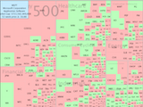
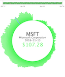

# Stock Market Visualization

A visualization of stock market data written in Processing, utilizing the MVC framework

<strong>Data provided for free by <a href="https://iextrading.com/developer">IEX</a>. View IEX’s <a href="https://iextrading.com/api-exhibit-a/">Terms of Use</a>.</strong>

<!--  -->

  
   

## Setup and Run

1. Download and install Processing: https://processing.org/download/  
2. Download and install the treemappa package:  http://www.treemappa.com/  
3. Set the value of the `CSV_FILE_NAME` constant in the `TreeMapChart` class to the absolute filepath of the data/sp500-treemap-data.csv file  
4. Using Processing, run the Main.pde file  

