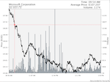
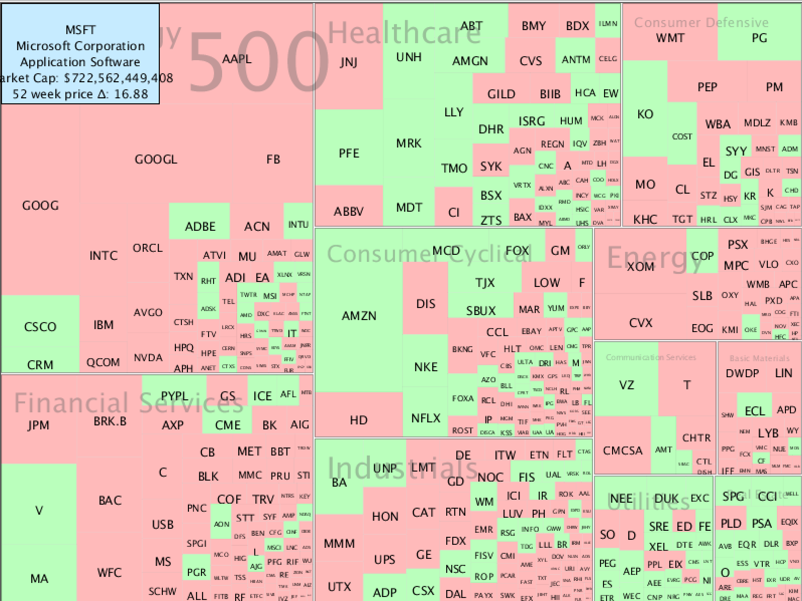

# Stock Market Visualization

  
   
   

A visualization of stock market data written in Processing, utilizing the MVC framework

<strong>Data provided for free by <a href="https://iextrading.com/developer">IEX</a>. View IEX’s <a href="https://iextrading.com/api-exhibit-a/">Terms of Use</a>.</strong>

## Setup and Run

1. Download and install Processing: https://processing.org/download/  
2. Download and install the treemappa package:  http://www.treemappa.com/  
3. Set the value of the `CSV_FILE_NAME` constant in the `TreeMapChart` class to the absolute filepath of the data/sp500-treemap-data.csv file  
4. Ensure the <a href="data/sp-500-symbols.txt">listing of symbols for companies in the S&P 500</a> is up-to-date and accurate.
4. Using Processing, run the Main.pde file  

## Overview

This project is written in <a href="https://processing.org/">Processing</a> language/library/IDE.  It implements three interactive stock market charts in the MVC framework.  The first visualization (view 1) is a <a href="https://en.wikipedia.org/wiki/Treemapping">treemap</a> displaying data of the <a href="https://en.wikipedia.org/wiki/S%26P_500_Index">S&P 500</a> for the last day:

	

The primary "tiles" in the treemap correspond to the sectors of the stock market (e.g. Technology, Healthcare, Consumer Defensive, etc.), and the "sub-tiles" within correspond to the S&P 500 companies within those sectors.  The size of each tile corresponds to the market cap of that sector/company relative to the total market cap of the S&P 500.  Hovering over a subtile will display a company's name, sub-sector, and most recent end-of-day: market capitalization and 52 week price change.  Clicking on a subtile will launch view 2.

