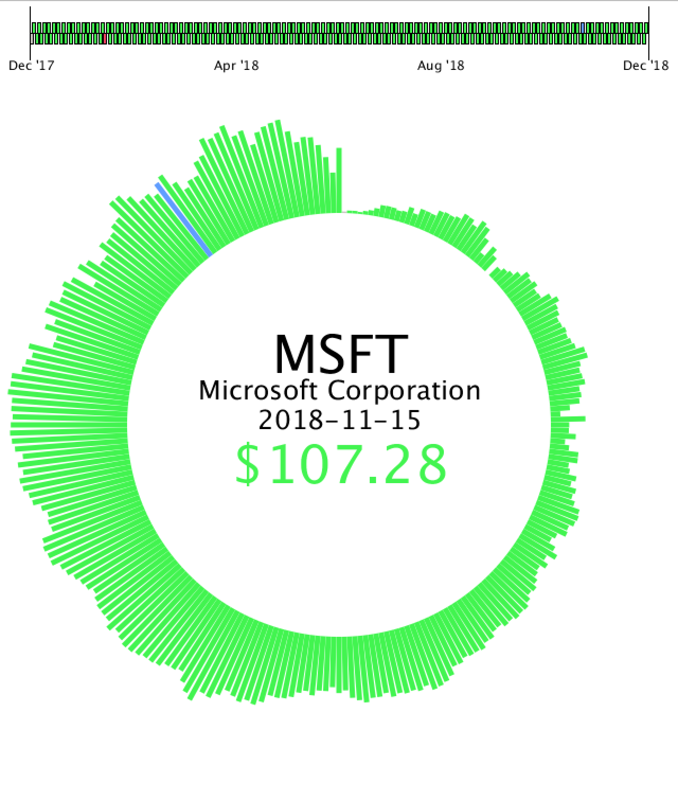
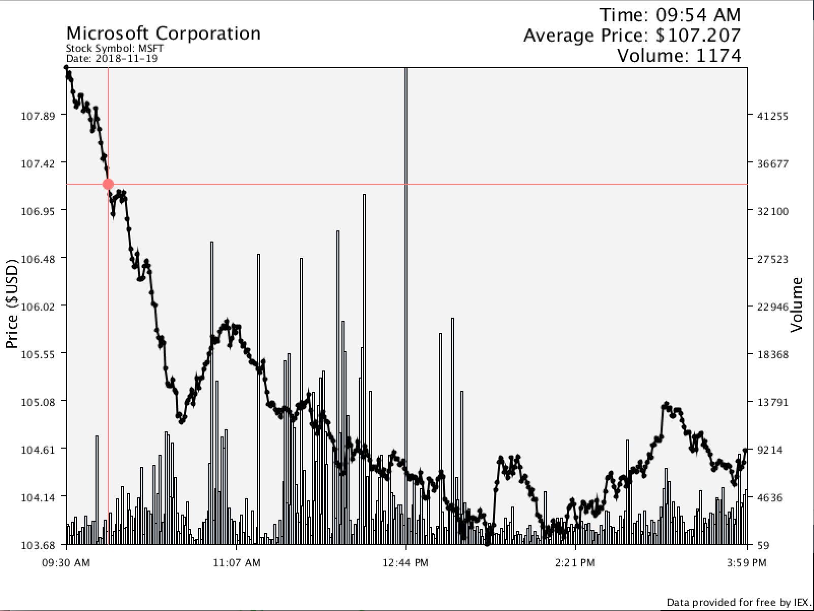

# Stock Market Visualization

  
   
   

A visualization of stock market data written in Processing, utilizing the model-view-controller (MVC) framework

<strong>Data provided for free by <a href="https://iextrading.com/developer">IEX</a>. View IEX’s <a href="https://iextrading.com/api-exhibit-a/">Terms of Use</a>.</strong>

## Setup and Run

1. Download and install Processing: https://processing.org/download/  
2. Download and install the treemappa package:  http://www.treemappa.com/  
3. Set the value of the `CSV_FILE_NAME` constant in the `TreeMapChart` class to the absolute filepath of the data/sp500-treemap-data.csv file  
4. Ensure the <a href="Main/data/sp-500-symbols.txt">listing of symbols for companies in the S&P 500</a> is up-to-date and accurate.
4. Using Processing, run the Main.pde file  

## Overview

This project is written in <a href="https://processing.org/">Processing</a> language/library/IDE.  It implements three interactive stock market charts in the MVC framework.  The first visualization (view 1) is a <a href="https://en.wikipedia.org/wiki/Treemapping">treemap</a> displaying data of the <a href="https://en.wikipedia.org/wiki/S%26P_500_Index">S&P 500</a> for the last day:

	

The primary "tiles" in the treemap correspond to the sectors of the stock market (e.g. Technology, Healthcare, Consumer Defensive, etc.), and the "sub-tiles" within correspond to the S&P 500 companies within those sectors.  The size of each tile corresponds to the market cap of that sector/company relative to the total market cap of the S&P 500.  Hovering over a subtile will display a company's name, sub-sector, and most recent end-of-day: market capitalization and 52 week price change.  Clicking on a subtile will launch view 2:

	

View 2 displays the average daily stock price of a single symbol for the last 52 weeks. Daily prices are displayed as bars on the perimeter of a circle.  The height of the bar corresponds to the average stock price for that day, mapped into the min/max space of all prices for the given time frame.  Bars are colored green if they are greater than the value of the 1st observation of the time frame, grey if they are equal, and red if they are less. Each bar has a corresponding "tick" in the "legend" at the top of the visualization. Hovering over each of these ticks provides additional information in the center of the main circle for the relevant day.  Clicking on a tick launches view 3.  Due to the restrictions of the <a href="https://iextrading.com/developer">IEX API</a>, only the last 30 days have available data and can be clicked to launch view 3.

	

View 3 provides a time series for the average price of a single stock over the course of one trading session (i.e. one day).  The frequency of the data is one minute.  Hover the mouse over each observation (or rather, an X-intersection to be precise) causes the display to update with data relevant to that observation.

## A Note About the Investors Exchange

The Investors Exchange (IEX) is a new stock exchange which was founded to favor the trading activities of  long-term investors such as mutual funds and pension funds over high frequency traders. The IEX generously provides a <a href="https://iextrading.com/developer/">free, easy to use, and well documented API</a>. The founding of the IEX is documented in the fascinating book <a href="https://www.amazon.com/Flash-Boys-Wall-Street-Revolt/dp/0393351599">Flash Boys: A Wall Street Revolt</a> by Michael Lewis.
